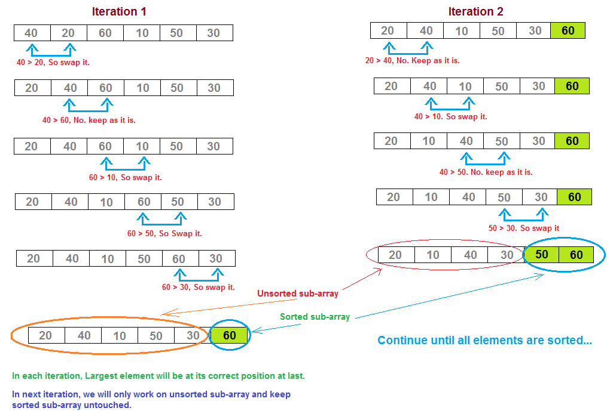
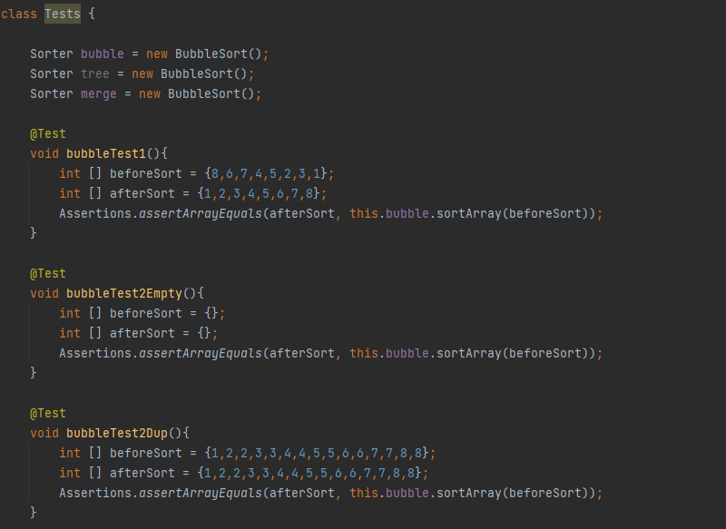

# Sort Manager - Sparta Global Project
This project is fitted with a `MIT License.`

- Asks for a choice of Sort Type (Merge, Bubble, Tree)
- Will then take an inputted array list and convert to a local variable
- Will then sort the array list and output the sorted array.
- More details below



```
www.softwaretestinghelp.com/merge-sort-java/
https://www.javatpoint.com/bubble-sort-in-java
https://www.geeksforgeeks.org/tree-sort
```

### Testing
- All testing was done using the JUint Testing Extension built into IntelliJ

```